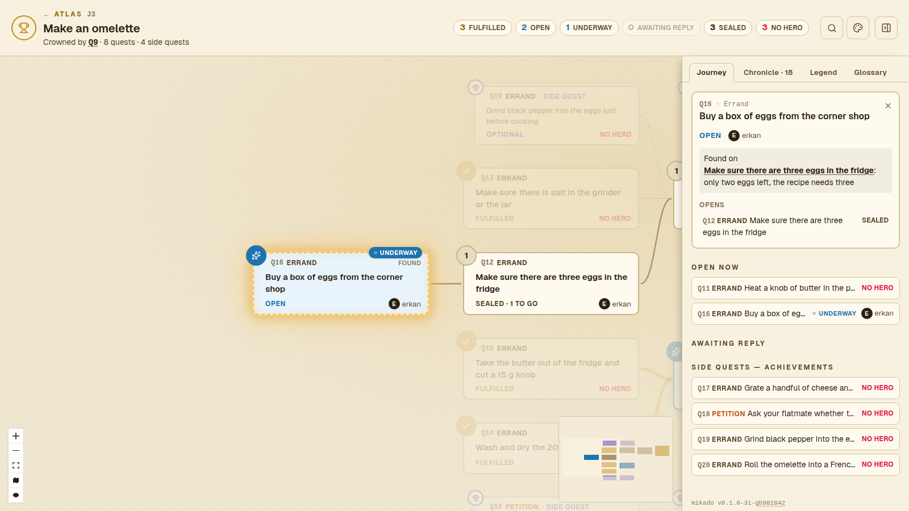
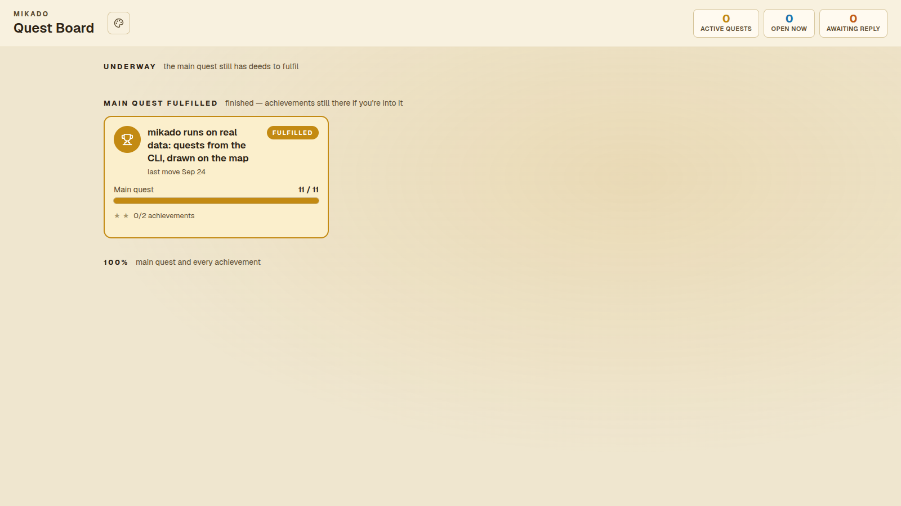
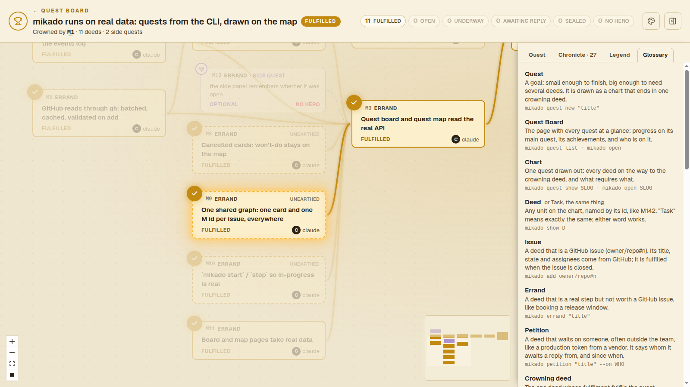
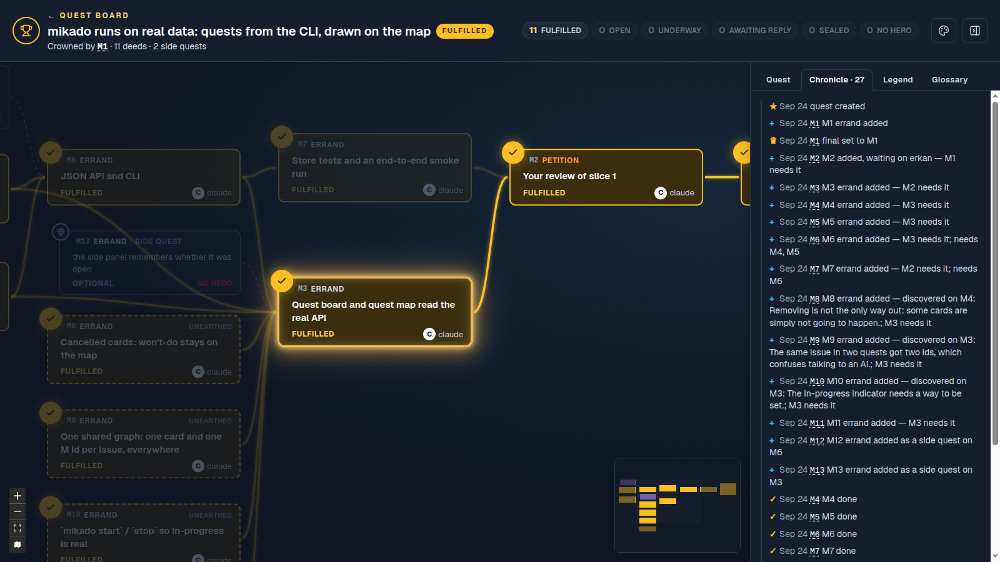
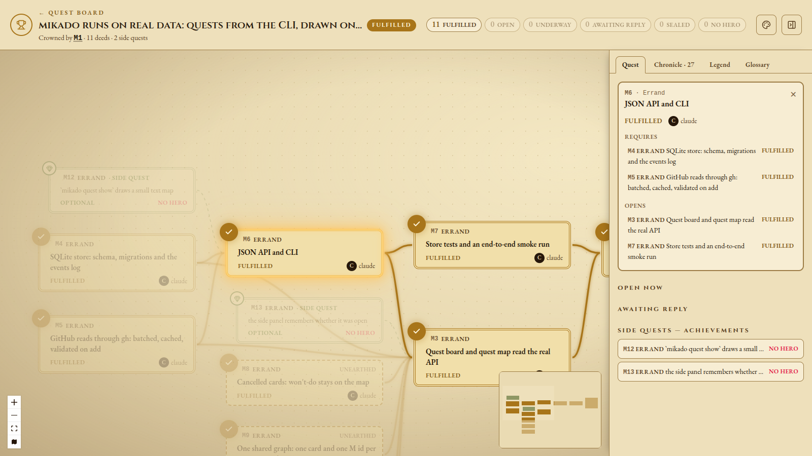

# mikado

A local tool for grouping GitHub issues (across repos) under small goals — **quests** — and tracking
the side issues unearthed along the way. One static Go binary: `mikado serve` runs a JSON API and a
web dashboard that draws each quest as a chart; every other command is a thin client of that API
(Claude Code fills quests through it).

Local-first: the server listens on loopback only and has no authentication yet. All data goes
through the API, so auth can be added there later. GitHub is reached through the `gh` CLI, which
holds the token; mikado stores no credentials.

The name comes from the [Mikado Method](https://mikadomethod.info/): put the goal at the top,
try to reach it, and record every prerequisite you run into on the way. mikado keeps that graph
across repos and people, so the end goal stays in view while side issues pile up.



| The Quest Board | Glossary tab |
|---|---|
|  |  |
| **Midnight theme** | **Medieval theme** |
|  |  |

**The words** — quest, chart, deed (or task), crowning deed, requires/opens, petition, sealed,
abandoned, struck, underway, hero, chronicle and the rest — are defined once, in the glossary in
[`src/internal/skill/SKILL.md`](src/internal/skill/SKILL.md#glossary). The dashboard shows the same
list in its Glossary tab.

## Prerequisites

- Go 1.27+
- bun 1.3+ (frontend package manager and script runner)
- `gh`, logged in (`gh auth status`): mikado reads and assigns issues through it

## Layout

All code is under `src/`: the Go module (`src/go.mod`, module `mikado`) and the Vite + React +
TypeScript app at `src/web`.

| Go package | What it is |
|---|---|
| `cmd/mikado` | the CLI and `serve` |
| `internal/store` | SQLite (pure-Go `modernc.org/sqlite`), embedded migrations, status computation — the only code that touches the database |
| `internal/github` | batch issue reads (`gh api graphql`), assign/unassign (`gh issue edit`), assignable users |
| `internal/api` | the JSON API under `/api` |
| `internal/web` | `/api/health`, mounts the API, serves the embedded frontend |

## The model

One global graph of deeds and requirements; each quest is a view onto it, drawn as a chart.

- A **deed** (or task) exists once and has a global id, shown as **`M142`**. It is one of:
  - an **issue**: a GitHub issue `owner/repo#n`. There is at most one live deed per issue. Its
    title, state and assignees come from GitHub, cached ~60 s.
  - an **errand**: a step not worth an issue, with a local title, fulfilled flag and hero.
  - a **petition**: waiting on someone, with a local title, fulfilled flag, whom it awaits a reply
    from, since when, and a hero.

  Wherever a deed is expected, it can be given as `M142`, `M-142`, `m142`, `c142`, `142`,
  `owner/repo#n` or an issue URL.
- **Requires** ("M5 requires M3": M3 must be fulfilled first; M3 opens M5) is the only blocking
  relation. Requirements are global and acyclic across the whole graph.
  A deed hung on another with `--side-of` is a **side quest**: optional, never blocks and never
  requires or opens anything; it earns an **achievement**. A deed **unearthed** on the way records
  where (`--unearthed-on`) and why (`--reason`); an **NPC** badge is decoration.
- A **quest** has a slug, a title and a **crowning deed**. Its deeds are computed, never stored:
  the crowning deed, everything it transitively requires (the **main quest**), and the side quests
  of any of them (recursively). A deed joins a quest by being linked in (`--opens`, `require`,
  `--side-of`, `--crowns`) and leaves when the link is cut (`unrequire`). One deed can be in several
  quests. A deed with no links is in no quest. A quest without a crowning deed has no deeds yet.
- **Slugs** are short handles (the first few significant words of the title, suffixed `-2` on a
  clash). They are matched ignoring case and can be renamed.
- **Two ways to take a deed out**, like GitHub:
  - **Strike** means gone for good. The deed leaves the graph (it stays in the chronicle), and so
    do its side quests. A quest whose crowning deed is struck has none.
  - **Abandon** means won't do. The deed stays on the chart, blocks nothing and counts in no
    progress total. Its side quests are abandoned with it. An issue closed on GitHub as
    `NOT_PLANNED` or `DUPLICATE` reads as abandoned. Any deed, including an open issue, can also be
    abandoned locally.
- **Status is computed**, never stored: **abandoned**, else **fulfilled** (issue closed / flag
  set), else **sealed** while anything it requires is neither fulfilled nor abandoned, else
  **awaiting reply** for petitions and **open** for the rest. A quest is fulfilled when its
  crowning deed is, abandoned when its crowning deed is, and active otherwise.
- **Underway** (someone is on it, optionally by name) is set explicitly with `take-up` and
  `set-down`, apart from status. It is cleared when the deed is fulfilled or abandoned.
- **The chronicle**: every change is an event, written as a sentence. A quest's chronicle is its
  own events (created, renamed, crowned) plus the events of the deeds on its chart. Sentences
  written before the vocabulary changed keep their old words.
- **Heroes**: a deed's hero is its GitHub assignee, else the hero set with `--hero`.

The API and the database keep plain, older names (`cards`, `needs`, `done`, `locked`, `final`,
`owner`, `working`, `log`); the dashboard and the CLI's text show the words above. SKILL.md maps
one to the other under [JSON field names](src/internal/skill/SKILL.md#json-field-names).

## Data

`mikado serve` keeps everything in `mikado.db` (SQLite, WAL) in the data directory: `--data DIR`,
else `$MIKADO_DATA`, else `$XDG_DATA_HOME/mikado`, else `~/.local/share/mikado`.

## Use

```bash
mikado serve &                                   # http://127.0.0.1:47291
mikado quest new "The winter update ships to every player"   # -> winter-update-ships-every
mikado quest rename winter-update-ships-every winter-update
mikado add studio/game#140 --crowns winter-update             # M1, the crowning deed
mikado add studio/saves#88 --opens M1                         # M2: M1 requires it
mikado add studio/saves#91 --opens M2 --unearthed-on M2 --reason "old saves crash the loader"
mikado errand "Book the store-page feature slot" --hero ada --opens M1
mikado petition "Final key art" --on "freelance artist" --opens studio/game#140
mikado add studio/saves#88 --opens M9           # same deed M2, now also in M9's quest
mikado take-up M2 --by cyd
mikado abandon M5 --reason "split-screen co-op is cut from this update"
mikado show M2                                   # requires, opens, side quests, quests
mikado quest show winter-update                  # the chart as text, or --json
mikado open M2                                   # the chart in the browser, M2 selected
mikado help                                      # every command
```

Client commands reach the server at `--server URL` / `$MIKADO_SERVER` (default
`http://127.0.0.1:47291`), take `--json`, and exit non-zero with the API's error message on failure.
Earlier command and flag names (`done`, `cancel`, `remove`, `start`, `need`, `await`,
`quest final`, `--needed-by`, `--found-while`, `--owner`, …) still work but are no longer listed.

## Install

```bash
make install           # build, copy to ~/.local/bin/mikado, refresh the agent skill
make install-service   # also run `mikado serve` as a systemd user service (contrib/mikado.service)
```

After an upgrade, `make install` alone rebuilds, replaces the binary and restarts the service if
it is running. `systemctl --user status mikado` / `journalctl --user -u mikado` for the service.

## For AI agents

The guide an agent needs to use mikado well — the model, the `M` ids, the glossary, when to record
an unearthed deed, abandon versus strike — is `src/internal/skill/SKILL.md`, embedded in the binary
so it always matches the installed version:

```bash
mikado skill            # print it
mikado skill install    # write it to ~/.claude/skills/mikado/SKILL.md, where Claude Code finds it
mikado skill path       # where install puts it (--dir DIR to choose)
```

Reinstalling after an upgrade overwrites the file it wrote before; any other file at that path
is left alone unless you pass `--force`. `mikado help` points agents at `mikado skill`.

## API

JSON under `/api`; errors are `{"error": "..."}` with 400/404/409/502. Bodies must be sent as
`Content-Type: application/json`, and requests must be addressed to localhost. The routes and
fields keep the machine names: a *card* is a deed, a *need* `{from, to}` is "from requires to",
*final* is the crowning deed, *owner* the hero. A `{id}` in a path takes any deed id form (`142`,
`M142`, …).

| | |
|---|---|
| `GET /api/quests` | Quest Board summaries (a GitHub warning, if any, in the `X-Mikado-GitHub` header) |
| `POST /api/quests` `{title, slug?, final?}` | create a quest; `final` (its crowning deed) is a deed id or reference string |
| `GET /api/quests/{slug}` | `{quest, cards, needs, log, github?}`: its deeds, requirements and chronicle; each deed has `key` and `alsoIn` |
| `PATCH /api/quests/{slug}` `{slug?, title?, final?}` | rename, retitle, crown |
| `POST /api/cards` `{kind, ref?, title?, sideOf?, foundWhile?, reason?, needs?, neededBy?, waitingOn?, owner?, npc?, finalOf?}` | add a deed (201). An issue that is already a deed gives 200 with that deed, and the links are applied to it |
| `GET /api/cards/{ref}` | `{card, quests, needs, neededBy, sideQuests}`; `{ref}` may be `owner/repo%23n` |
| `PATCH /api/cards/{id}` `{done?, owner?, npc?, title?, cancelled?, cancelReason?, working?, workingBy?}` | change a deed: fulfil, hero, NPC, title, abandon, take up / set down |
| `DELETE /api/cards/{id}` `{reason}` | strike a deed and its side quests |
| `POST`/`DELETE /api/needs` `{from, to}` | add / drop a requirement (`from` requires `to`) |
| `POST /api/cards/{id}/assignees` `{add, remove}` | assign on GitHub (issues) |
| `GET /api/repos/{owner}/{repo}/assignees` | assignable logins |

The quest-scoped routes `POST /api/quests/{slug}/cards`, `PATCH`/`DELETE
/api/quests/{slug}/cards/{id}`, `POST /api/quests/{slug}/cards/{id}/assignees` and
`POST`/`DELETE /api/quests/{slug}/needs` remain as aliases. They check the quest exists; there,
`final: true` means "crowning deed of this quest", and the returned deed's `alsoIn` leaves that
quest out.

## Develop

```bash
make run        # build everything and serve on http://127.0.0.1:47291
make dev-web    # in a second terminal: Vite dev server with HMR, /api proxied to the Go server
```

Override the address with `make run ADDR=127.0.0.1:9000` (and the same `ADDR` for `dev-web`).

## Build and check

```bash
make build      # frontend into src/internal/web/dist, then bin/mikado with it embedded
make check      # tsc --noEmit + go vet
make test       # go test ./... (store tests use a temp database and a fake GitHub)
./bin/mikado version
./bin/mikado serve --addr 127.0.0.1:47291
```

## Licence

MIT — see [LICENSE](LICENSE).
