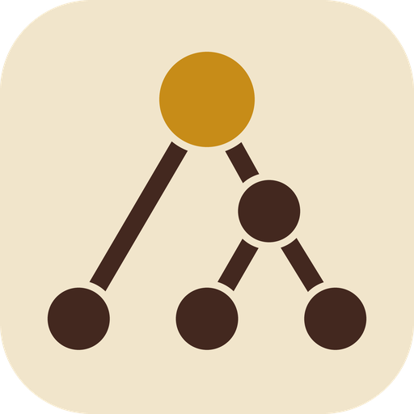

#  mikado

A task map for any goal. A **journey** is the goal; **quests** are the steps toward it, each with
what it requires and why it was added, and anything found along the way. A journey can span ten
repos or none: shipping a release, learning a language, or cooking an omelette. A quest is a
GitHub issue, an **errand** (a step that lives only in mikado) or a **petition** (waiting on
someone's reply).

One static Go binary: `mikado serve` runs a JSON API and a web dashboard that draws each journey
as a chart; every other command is a thin client of that API (AI agents like Claude Code fill
journeys through it).

Local-first: the server listens on loopback only and has no authentication yet. All data goes
through the API, so auth can be added there later. GitHub is optional: when a quest is an issue,
it is reached through the `gh` CLI, which holds the token; mikado stores no credentials.

The name comes from the [Mikado Method](https://mikadomethod.info/): put the goal at the top,
try to reach it, and record every prerequisite you run into on the way. mikado keeps that graph
across projects, people and plain life, so the end goal stays in view while side issues pile up.


| The Atlas | Glossary tab |
|---|---|
|  |  |
| **Midnight theme** | **War table theme** |
|  |  |

**The words** — journey, atlas, chart, quest (or task), crowning quest, requires/opens, petition,
sealed, abandoned, struck, underway, hero, chronicle and the rest — are defined once, in the glossary in
[`src/internal/skill/SKILL.md`](src/internal/skill/SKILL.md#glossary). The dashboard shows the same
list in its Glossary tab.

## Prerequisites

- Go 1.27+
- bun 1.3+ (frontend package manager and script runner)
- `gh`, logged in (`gh auth status`): mikado reads and assigns issues through it

## Layout

All code is under `src/`: the Go module (`src/go.mod`, module `mikado`) and the Vite + React +
TypeScript app at `src/web`.

| Go package | What it is |
|---|---|
| `cmd/mikado` | the CLI and `serve` |
| `internal/store` | SQLite (pure-Go `modernc.org/sqlite`), embedded migrations, status computation — the only code that touches the database |
| `internal/github` | batch issue reads (`gh api graphql`), assign/unassign (`gh issue edit`), assignable users |
| `internal/api` | the JSON API under `/api` |
| `internal/web` | `/api/health`, mounts the API, serves the embedded frontend |

## The model

One global graph of quests and requirements; each journey is a view onto it, drawn as a chart.

- A **quest** (or task) exists once and has a global id, shown as **`Q142`**. It is one of:
  - an **issue**: a GitHub issue `owner/repo#n`. There is at most one live quest per issue. Its
    title, state and assignees come from GitHub, cached ~60 s.
  - an **errand**: a step not worth an issue, with a local title, fulfilled flag and hero.
  - a **petition**: waiting on someone, with a local title, fulfilled flag, whom it awaits a reply
    from, since when, and a hero.

  Wherever a quest is expected, it can be given as `Q142`, `Q-142`, `q142`, `142`, `owner/repo#n`
  or an issue URL, or as a journey's id (`J7`), which names that journey's crowning quest.
- **Requires** ("Q5 requires Q3": Q3 must be fulfilled first; Q3 opens Q5) is the only blocking
  relation. Requirements are global and acyclic across the whole graph.
  A quest hung on another with `--side-of` is a **side quest**: optional, never blocks and never
  requires or opens anything; it earns an **achievement**. A quest **found** on the way records
  where (`--found-on`) and why (`--reason`). An **NPC** quest changes nothing but its looks: it
  shows in red on the chart. Right-click a quest there to mark or unmark it (CLI: `--npc`,
  `set Q --npc=true|false`).
- A **journey** has an id (`J7`), a title and a **crowning quest**. The id never changes; the
  title can. Its quests are computed, never stored: the crowning quest, everything it
  transitively requires (the **main quest**), and the side quests of any of them (recursively). A
  quest joins a journey by being linked in (`--opens`, `require`, `--side-of`, `--crowns`) and
  leaves when the link is cut (`unrequire`). One quest can be in several journeys. A quest with no
  links is in no journey. A journey without a crowning quest has no quests yet.
- **A journey can wait on another journey.** A quest that requires another journey's crowning
  quest (`mikado require Q5 J2`) waits on that whole journey. On the chart, that crowning quest is
  drawn as one card for the other journey: its title, its progress, what is still to do in it,
  and a link to its own chart. It counts as one quest, in the progress and on the Atlas. The other
  journey's quests stay on their own chart: they are not this journey's quests, so they are left
  out of its counts, its chronicle and `journey show`, unless this journey reaches them some other
  way. A journey's own crowning quest is always its own, even when another journey shares it. The
  Atlas says which journeys are blocked by which. This is not a side quest: a side quest is
  optional, while the other journey here blocks the quest that requires it.
- **Archiving** a journey puts it away. It leaves the Atlas's shelves for a closed "Archived"
  shelf at the bottom, and it leaves `journey list` unless you pass `--all`. Nothing else changes:
  its quests, chart and chronicle stay, and so does its URL. `journey unarchive` brings it back.
- **Two ways to take a quest out**, like GitHub:
  - **Strike** means gone for good. The quest leaves the graph (it stays in the chronicle), and so
    do its side quests. A journey whose crowning quest is struck has none.
  - **Abandon** means won't do. The quest stays on the chart, blocks nothing and counts in no
    progress total. Its side quests are abandoned with it. An issue closed on GitHub as
    `NOT_PLANNED` or `DUPLICATE` reads as abandoned. Any quest, including an open issue, can also
    be abandoned locally.
- **Status is computed**, never stored: **abandoned**, else **fulfilled** (issue closed / flag
  set), else **sealed** while anything it requires is neither fulfilled nor abandoned, else
  **awaiting reply** for petitions and **open** for the rest. A journey is fulfilled when its
  crowning quest is, abandoned when its crowning quest is, and active otherwise.
- **Underway** (someone is on it, optionally by name) is set explicitly with `take-up` and
  `set-down`, apart from status. It is cleared when the quest is fulfilled or abandoned.
- **The chronicle**: every change is an event, written as a sentence. A journey's chronicle is its
  own events (created, retitled, crowned) plus the events of the quests on its chart. Sentences
  written before the vocabulary changed keep their old words.
- **Heroes**: a quest's hero is its GitHub assignee, else the hero set with `--hero`.

The API and the database keep plain, older names (`cards`, `needs`, `done`, `locked`, `final`,
`owner`, `working`, `log`); the dashboard and the CLI's text show the words above. SKILL.md maps
one to the other under [JSON field names](src/internal/skill/SKILL.md#json-field-names).

## Data

`mikado serve` keeps everything in `mikado.db` (SQLite, WAL) in the data directory: `--data DIR`,
else `$MIKADO_DATA`, else `$XDG_DATA_HOME/mikado`, else `~/.local/share/mikado`.

## Use

```bash
mikado serve &                                   # http://127.0.0.1:47291
mikado journey new "The winter update ships to every player"   # -> journey J1
mikado journey set J1 --title "Winter update"    # retitle; J1 stays J1
mikado journey archive J4                        # off the Atlas and `journey list` (--all shows it)
mikado add studio/game#140 --crowns J1           # Q1, the crowning quest
mikado add studio/saves#88 --opens Q1            # Q2: Q1 requires it
mikado add studio/saves#91 --opens Q2 --found-on Q2 --reason "old saves crash the loader"
mikado errand "Book the store-page feature slot" --hero ada --opens Q1
mikado petition "Final key art" --on "freelance artist" --opens studio/game#140
mikado add studio/saves#88 --opens Q9            # same quest Q2, now also in Q9's journey
mikado require Q1 J2                             # Q1 waits on that whole journey: one card on the chart
mikado errand "Controller glyphs in the trailer" --opens J2   # a journey id names its crowning quest
mikado take-up Q2 --by cyd
mikado abandon Q5 --reason "split-screen co-op is cut from this update"
mikado show Q2                                   # requires, opens, side quests, journeys
mikado journey show J1                           # the chart as text, or --json
mikado open Q2                                   # the chart in the browser, Q2 selected
mikado help                                      # every command
```

Client commands reach the server at `--server URL` / `$MIKADO_SERVER` (default
`http://127.0.0.1:47291`), take `--json`, and exit non-zero with the API's error message on failure.
Earlier command and flag names (`done`, `cancel`, `remove`, `start`, `need`, `await`,
`--needed-by`, `--owner`, …) still work but are no longer listed.

### Reaching it under another name

`serve` still listens on loopback only, and it answers only requests addressed to `localhost`, to a
name under it (`mikado.localhost`: browsers resolve every `*.localhost` to loopback themselves), or
to a loopback IP. That check is what stops DNS rebinding, where another site's page points its own
domain at 127.0.0.1; no site can make the browser send `localhost` or `*.localhost` as the host.
CORS would not help here: under your own domain, the dashboard and the API are the same origin. To
open mikado through a reverse proxy or `tailscale serve` under a name of your own, accept that name:

```bash
mikado hosts add mikado.home '*.ts.net'   # *.x: any subdomain of x; accepted at once
mikado hosts                              # what is accepted, and where from
mikado hosts remove mikado.home           # refused again at once
```

The list lives in the database, so it survives restarts, and it changes while the server runs.
Hosts can be added and removed only through `localhost` or a loopback IP (the CLI's default
server), never through a name that reaches mikado from elsewhere. `serve --allow-host NAME`
(repeatable) and `MIKADO_ALLOWED_HOSTS=mikado.home,*.ts.net` still work; they add hosts for that
run only, which `hosts remove` cannot take away.

The proxy must pass the original `Host` header through, which Caddy and `tailscale serve` do by
default. `make dev-web` reads `MIKADO_ALLOWED_HOSTS` for Vite's `allowedHosts` (it does not see
the stored list). Anyone who can reach an accepted name can read and change everything, because
there is no authentication yet.

## Install

Needs Go and [bun](https://bun.sh); `make` alone lists every target.

```bash
make install           # build, copy to ~/.local/bin/mikado, refresh the agent skill
make install-service   # also run `mikado serve` as a systemd user service (contrib/mikado.service)
make update            # git pull, then install again (restarts the service if it is running)
make uninstall         # remove the binary, the skill and the service; keeps ~/.local/share/mikado
```

`make install` alone also rebuilds, replaces the binary and restarts the service if it is running.
For the service: `make start`, `stop`, `restart`, `status` and `logs` (follows the journal).
The dashboard shows the running server's version in small print (its commit links to GitHub), and
`mikado version` prints the CLI's version next to the server's, saying so when they differ.

## For AI agents

The guide an agent needs to use mikado well — the model, the `Q` and `J` ids, the glossary, when to
record a found quest, abandon versus strike — is `src/internal/skill/SKILL.md`, embedded in the binary
so it always matches the installed version:

```bash
mikado skill            # print it
mikado skill install    # write it to ~/.claude/skills/mikado/SKILL.md, where Claude Code finds it
mikado skill path       # where install puts it (--dir DIR to choose)
```

Reinstalling after an upgrade overwrites the file it wrote before; any other file at that path
is left alone unless you pass `--force`. `mikado help` points agents at `mikado skill`.

## API

JSON under `/api`; errors are `{"error": "..."}` with 400/404/409/502. Bodies must be sent as
`Content-Type: application/json`, and requests must be addressed to localhost, `*.localhost` or an
accepted host (`mikado hosts`); a refused host gets 403. The routes and fields keep the machine names: a *card* is a quest, a *need* `{from, to}` is "from requires to",
*final* is the crowning quest, *owner* the hero. A `{id}` in a path takes any quest id form (`142`,
`Q142`, …) or a journey id (`J7`: that journey's crowning quest); so do `final` and `{ref}`. A
`{key}` is a journey id.

| | |
|---|---|
| `GET /api/journeys` | the Atlas: journey summaries (a GitHub warning, if any, in the `X-Mikado-GitHub` header). `blockedBy` lists the journeys `[{key, title, state, archivedAt?}]` whose crowning quests are on this journey's chart as journey cards; `blocks` the journeys with this one's on theirs |
| `POST /api/journeys` `{title, final?}` | create a journey; `final` (its crowning quest) is a quest id or reference string |
| `GET /api/journeys/{key}` | `{journey, cards, needs, log, github?}`: its quests, requirements and chronicle; each quest has `key` and `alsoIn`. A quest that crowns another journey has `crowns: {key, title, state, archivedAt?, done, total, working, open: [{key, title, status, working}]}`: that journey, its main-quest progress counted as the Atlas counts it, how many of its quests are underway, and its quests still to do. Its own quests are not in `cards` |
| `PATCH /api/journeys/{key}` `{title?, final?, archived?}` | retitle, crown, archive (`true`) or bring back (`false`); an archived journey has `archivedAt` |
| `POST /api/cards` `{kind, ref?, title?, sideOf?, foundWhile?, reason?, needs?, neededBy?, waitingOn?, owner?, npc?, finalOf?}` | add a quest (201); `finalOf` is a journey id. An issue that is already a quest gives 200 with that quest, and the links are applied to it |
| `GET /api/search?q=` | `{journeys, quests, exact?}`: journeys by id and title, quests by id, issue and title (every word, any case; issue titles from the cache). `exact` is the quest the query names by id or issue. Quests still to do come first |
| `GET /api/cards/{ref}` | `{card, journeys, needs, neededBy, sideQuests}`; `{ref}` may be `owner/repo%23n` or a journey id. A crowning quest's `card.crowns` names the journey it crowns, as above |
| `PATCH /api/cards/{id}` `{done?, owner?, npc?, title?, cancelled?, cancelReason?, working?, workingBy?}` | change a quest: fulfil, hero, NPC, title, abandon, take up / set down |
| `DELETE /api/cards/{id}` `{reason}` | strike a quest and its side quests |
| `POST`/`DELETE /api/needs` `{from, to}` | add / drop a requirement (`from` requires `to`) |
| `POST /api/cards/{id}/assignees` `{add, remove}` | assign on GitHub (issues) |
| `GET /api/repos/{owner}/{repo}/assignees` | assignable logins |
| `GET /api/hosts` | `[{name, source, addedAt?}]`: the hosts accepted besides localhost; `source` is `flag` (`--allow-host`, `$MIKADO_ALLOWED_HOSTS`) or `stored` |
| `POST /api/hosts` `{name}` | accept a host from the next request on (201; 200 if already accepted). Only through localhost or a loopback IP (else 403) |
| `DELETE /api/hosts/{name}` | stop accepting a stored host (204); 409 for a `flag` one. Only through localhost or a loopback IP (else 403) |

The journey-scoped routes `POST /api/journeys/{key}/cards`, `PATCH`/`DELETE
/api/journeys/{key}/cards/{id}`, `POST /api/journeys/{key}/cards/{id}/assignees` and
`POST`/`DELETE /api/journeys/{key}/needs` are aliases. They check the journey exists; there,
`final: true` means "crowning quest of this journey", and the returned quest's `alsoIn` leaves
that journey out.

## Develop

```bash
make run        # build everything and serve on http://127.0.0.1:47291
make dev-web    # in a second terminal: Vite dev server with HMR, /api proxied to the Go server
```

Override the address with `make run ADDR=127.0.0.1:9000` (and the same `ADDR` for `dev-web`).

## Build and check

```bash
make build      # frontend into src/internal/web/dist, then bin/mikado with it embedded
make check      # tsc --noEmit + go vet
make test       # go test ./... (store tests use a temp database and a fake GitHub)
./bin/mikado version
./bin/mikado serve --addr 127.0.0.1:47291
```

## Licence

MIT — see [LICENSE](LICENSE).
