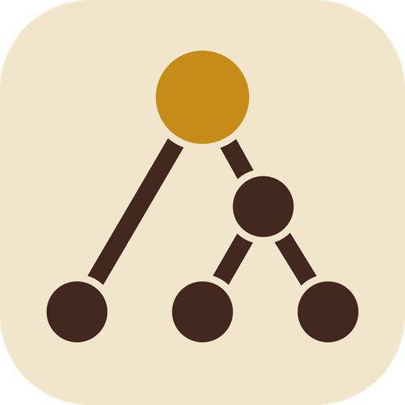
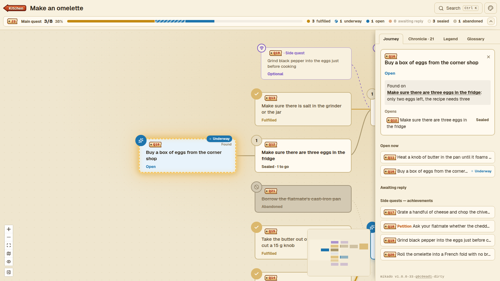
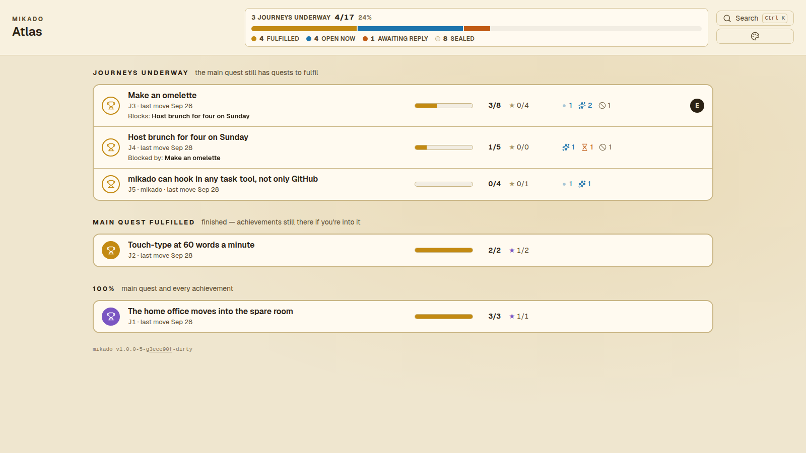
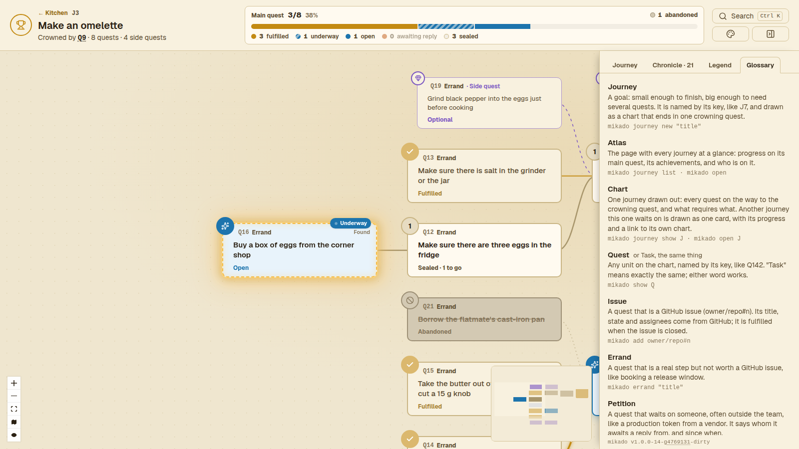
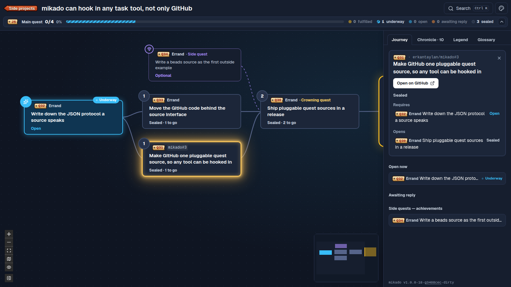
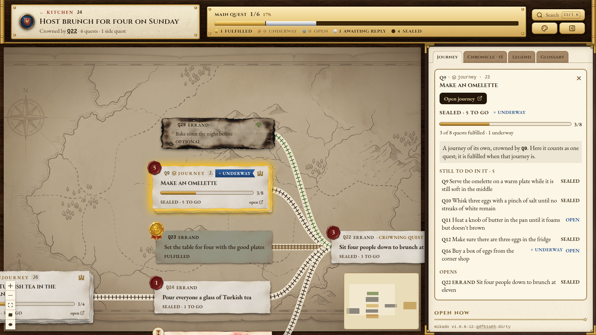

#  mikado

A task map for any goal. A **journey** is the goal; **quests** are the steps toward it, each with
what it requires and why it was added, and anything found along the way. A journey can span ten
repos or none: shipping a release, learning a language, or cooking an omelette. A quest is a title
and a status you set by hand, with an optional **link** (any URL) and **mark** (a short note such as
`#13` or a commit hash); a **petition** is a quest waiting on someone's reply.

One static Go binary: `mikado serve` runs a JSON API and a web dashboard that draws each journey
as a chart; every other command is a thin client of that API (AI agents like Claude Code fill
journeys through it).

Local-first: the server listens on loopback only and has no authentication yet. All data goes
through the API, so auth can be added there later. mikado talks to no outside tool and stores no
credentials: a quest tracked elsewhere carries that tool's link and number as its url and mark.

The name comes from the [Mikado Method](https://mikadomethod.info/): put the goal at the top,
try to reach it, and record every prerequisite you run into on the way. mikado keeps that graph
across projects, people and plain life, so the end goal stays in view while side issues pile up.



| The Atlas | Glossary tab |
|---|---|
|  |  |
| **Midnight theme** | **War table theme** |
|  |  |

**The words** — journey, atlas, chart, quest (or task), link, mark, crowning quest, requires/opens, petition,
sealed, abandoned, struck, underway, hero, chronicle and the rest — are defined once, in the glossary in
[`src/internal/skill/SKILL.md`](src/internal/skill/SKILL.md#glossary). The dashboard shows the same
list in its Glossary tab.

## Prerequisites

- Go 1.27+
- bun 1.3+ (frontend package manager and script runner)

## Layout

All code is under `src/`: the Go module (`src/go.mod`, module `mikado`) and the Vite + React +
TypeScript app at `src/web`.

| Go package | What it is |
|---|---|
| `cmd/mikado` | the CLI and `serve` |
| `internal/store` | SQLite (pure-Go `modernc.org/sqlite`), embedded migrations, status computation — the only code that touches the database |
| `internal/api` | the JSON API under `/api` |
| `internal/web` | `/api/health`, mounts the API, serves the embedded frontend |

## The model

One global graph of quests and requirements; each journey is a view onto it, drawn as a chart.

- A **quest** (or task) exists once and has a global id, shown as **`Q142`**. It has a title, a
  fulfilled flag and a hero, all set in mikado, and two optional properties:
  - a **link** (`--url`): any URL, never parsed; two quests may share one.
  - a **mark** (`--mark`): free text of at most 15 characters, kept as written, such as `#13`,
    `234g45a`, `feat(someh)` or `PROJ-88`. The chart shows it right after the quest's id, as a
    link when the quest has a url; the details panel links the quest's title.

  A quest added with `--on WHO` is a **petition**: it awaits a reply from someone, since the day
  it was made. `set Q --on -` makes it a plain quest again. Wherever a quest is expected, it can
  be given as `Q142`, `Q-142`, `q142` or `142`, or as a journey's id (`J7`), which names that
  journey's crowning quest.
- **Requires** ("Q5 requires Q3": Q3 must be fulfilled first; Q3 opens Q5) is the only blocking
  relation. Requirements are global and acyclic across the whole graph.
  A quest hung on another with `--side-of` is a **side quest**: optional, never blocks and never
  requires or opens anything; it earns an **achievement**. A quest **found** on the way records
  where (`--found-on`) and why (`--reason`). An **NPC** quest changes nothing but its looks: it
  shows in red on the chart. Right-click a quest there to mark or unmark it (CLI: `--npc`,
  `set Q --npc=true|false`).
- A **journey** has an id (`J7`), a title and a **crowning quest**. The id never changes; the
  title can. Its quests are computed, never stored: the crowning quest, everything it
  transitively requires (the **main quest**), and the side quests of any of them (recursively). A
  quest joins a journey by being linked in (`--opens`, `require`, `--side-of`, `--crowns`) and
  leaves when the link is cut (`unrequire`). One quest can be in several journeys. A quest with no
  links is in no journey. A journey without a crowning quest has no quests yet.
- **A journey can wait on another journey.** A quest that requires another journey's crowning
  quest (`mikado require Q5 J2`) waits on that whole journey. On the chart, that crowning quest is
  drawn as one card for the other journey: its title, its progress, what is still to do in it,
  and a link to its own chart. It counts as one quest, in the progress and on the Atlas. The other
  journey's quests stay on their own chart: they are not this journey's quests, so they are left
  out of its counts, its chronicle and `journey show`, unless this journey reaches them some other
  way. A journey's own crowning quest is always its own, even when another journey shares it. The
  Atlas says which journeys are blocked by which. This is not a side quest: a side quest is
  optional, while the other journey here blocks the quest that requires it.
- **Regions** group journeys (`R2`, with a name). Every journey lives in exactly one; a new one
  goes to R1, "Personal", unless `--region` names another. A quest stays inside one region: a
  requirement, crown, shared quest or journey waiting on another that would put a quest on
  journeys of two regions is refused. Journeys that share quests move together
  (`region move R J...`). The Atlas's home page lists the regions; each
  opens its own page (`/region/R2`, `mikado open R2`) with its journeys on their shelves, where
  the region can be renamed in place (or with `region set R --name`).
- **Archiving** a journey puts it away. It leaves the Atlas's shelves for a closed "Archived"
  shelf at the bottom, and it leaves `journey list` unless you pass `--all`. Nothing else changes:
  its quests, chart and chronicle stay, and so does its URL. `journey unarchive` brings it back.
- **Two ways to take a quest out**:
  - **Strike** means gone for good. The quest leaves the graph (it stays in the chronicle), and so
    do its side quests. A journey whose crowning quest is struck has none.
  - **Abandon** means won't do. The quest stays on the chart, blocks nothing and counts in no
    progress total. Its side quests are abandoned with it.
- **Status is computed** from the flags set by hand: **abandoned**, else **fulfilled**, else **sealed** while anything it requires is neither fulfilled nor abandoned, else
  **awaiting reply** for petitions and **open** for the rest. A journey is fulfilled when its
  crowning quest is, abandoned when its crowning quest is, and active otherwise.
- **Underway** (someone is on it, optionally by name) is set explicitly with `take-up` and
  `set-down`, apart from status. It is cleared when the quest is fulfilled or abandoned.
- **The chronicle**: every change is an event, written as a sentence. A journey's chronicle is its
  own events (created, retitled, crowned) plus the events of the quests on its chart. Sentences
  written before the vocabulary changed keep their old words.
- **Heroes**: a quest's hero is whoever is set with `--hero`.
- **Earlier databases** are migrated when the server opens them. A GitHub issue quest became a
  plain quest with the same id, its last known title, and its last known state as its own
  (closed as completed: fulfilled; closed as not planned or a duplicate: abandoned); everything
  else of mikado's own (hero, NPC, links, side quests, underway, chronicle) stays, and the GitHub
  data is dropped. Errands became plain quests.

The API and the database keep plain, older names (`cards`, `needs`, `done`, `locked`, `final`,
`owner`, `working`, `log`); the dashboard and the CLI's text show the words above. SKILL.md maps
one to the other under [JSON field names](src/internal/skill/SKILL.md#json-field-names).

## Data

`mikado serve` keeps everything in `mikado.db` (SQLite, WAL) in the data directory: `--data DIR`,
else `$MIKADO_DATA`, else `$XDG_DATA_HOME/mikado`, else `~/.local/share/mikado`.

## Use

```bash
mikado serve &                                   # http://127.0.0.1:47291
mikado journey new "The winter update ships to every player"   # -> journey J1
mikado journey set J1 --title "Winter update"    # retitle; J1 stays J1
mikado journey archive J4                        # off the Atlas and `journey list` (--all shows it)
mikado region new "Work"                          # -> region R2 (R1 is "Personal")
mikado journey new "Store page is live" --region Work
mikado region move Work J3 J4                     # together, when they share quests
mikado add "Ship the winter update" --crowns J1  # Q1, the crowning quest
mikado add "Save migration" --opens Q1 --mark "#88" --url https://tracker.example.com/saves/88
mikado add "Old saves crash the loader" --opens Q2 --found-on Q2 --reason "no version field"
mikado add "Book the store-page feature slot" --hero ada --opens Q1
mikado add "Final key art" --on "freelance artist" --opens Q1   # a petition
mikado set Q2 --mark 234g45a --url -             # change the mark, drop the link
mikado require Q9 Q2                             # Q2 now also opens Q9, in Q9's journey
mikado require Q1 J2                             # Q1 waits on that whole journey: one card on the chart
mikado add "Controller glyphs in the trailer" --opens J2   # a journey id names its crowning quest
mikado take-up Q2 --by cyd
mikado abandon Q5 --reason "split-screen co-op is cut from this update"
mikado show Q2                                   # requires, opens, side quests, journeys
mikado rewire Q1 Q2 Q3                           # Q1 requires Q3 instead of Q2, in one step
mikado journey extract J1 Q2 Q3 --title "Save format v2"   # a new journey, one card on J1
mikado delete Q4 --journey J1 --rewire Q2        # out of J1 only; Q2 takes over what hung on it
mikado delete Q4 --force --branch                # out of the database, with what only it held
mikado journey delete J4 --force                 # and the quests in no other journey
mikado journey show J1                           # the chart as text, or --json
mikado open Q2                                   # the chart in the browser, Q2 selected
mikado help                                      # every command
```

Client commands reach the server at `--server URL` / `$MIKADO_SERVER` (default
`http://127.0.0.1:47291`), take `--json`, and exit non-zero with the API's error message on failure.

### Reaching it under another name

`serve` still listens on loopback only, and it answers only requests addressed to `localhost`, to a
name under it (`mikado.localhost`: browsers resolve every `*.localhost` to loopback themselves), or
to a loopback IP. That check is what stops DNS rebinding, where another site's page points its own
domain at 127.0.0.1; no site can make the browser send `localhost` or `*.localhost` as the host.
CORS would not help here: under your own domain, the dashboard and the API are the same origin. To
open mikado through a reverse proxy or `tailscale serve` under a name of your own, accept that name:

```bash
mikado hosts add mikado.home '*.ts.net'   # *.x: any subdomain of x; accepted at once
mikado hosts                              # what is accepted, and where from
mikado hosts remove mikado.home           # refused again at once
```

The list lives in the database, so it survives restarts, and it changes while the server runs.
Hosts can be added and removed only through `localhost` or a loopback IP (the CLI's default
server), never through a name that reaches mikado from elsewhere. `serve --allow-host NAME`
(repeatable) and `MIKADO_ALLOWED_HOSTS=mikado.home,*.ts.net` still work; they add hosts for that
run only, which `hosts remove` cannot take away.

The proxy must pass the original `Host` header through, which Caddy and `tailscale serve` do by
default. `make dev-web` reads `MIKADO_ALLOWED_HOSTS` for Vite's `allowedHosts` (it does not see
the stored list). Anyone who can reach an accepted name can read and change everything, because
there is no authentication yet.

## Install

Needs Go and [bun](https://bun.sh); `make` alone lists every target.

```bash
make install           # build, copy to ~/.local/bin/mikado, refresh the agent skill
make install-service   # also run `mikado serve` as a systemd user service (contrib/mikado.service)
make update            # git pull, then install again (restarts the service if it is running)
make uninstall         # remove the binary, the skill and the service; keeps ~/.local/share/mikado
```

`make install` alone also rebuilds, replaces the binary and restarts the service if it is running.
For the service: `make start`, `stop`, `restart`, `status` and `logs` (follows the journal).
The dashboard shows the running server's version in small print (its commit links to the repo), and
`mikado version` prints the CLI's version next to the server's, saying so when they differ.

## For AI agents

The guide an agent needs to use mikado well — the model, the `Q` and `J` ids, the glossary, when to
record a found quest, abandon versus strike — is `src/internal/skill/SKILL.md`, embedded in the binary
so it always matches the installed version:

```bash
mikado skill            # print it
mikado skill install    # write it to ~/.claude/skills/mikado/SKILL.md, where Claude Code finds it
mikado skill path       # where install puts it (--dir DIR to choose)
```

Reinstalling after an upgrade overwrites the file it wrote before; any other file at that path
is left alone unless you pass `--force`. `mikado help` points agents at `mikado skill`.

## API

JSON under `/api`; errors are `{"error": "..."}` with 400/404/409; any change that would put a quest on journeys of two regions is refused with 409. Bodies must be sent as
`Content-Type: application/json`, and requests must be addressed to localhost, `*.localhost` or an
accepted host (`mikado hosts`); a refused host gets 403. The routes and fields keep the machine names: a *card* is a quest, a *need* `{from, to}` is "from requires to",
*final* is the crowning quest, *owner* the hero. A `{id}` in a path takes any quest id form (`142`,
`Q142`, …) or a journey id (`J7`: that journey's crowning quest); so do `final` and `{ref}`. A
`{key}` is a journey id.

| | |
|---|---|
| `GET /api/journeys` | the Atlas: journey summaries. `blockedBy` lists the journeys `[{key, title, state, archivedAt?}]` whose crowning quests are on this journey's chart as journey cards; `blocks` the journeys with this one's on theirs |
| `POST /api/journeys` `{title, final?, region?}` | create a journey; `final` (its crowning quest) is a quest id or reference string; `region` a region key or name (default: R1) |
| `GET /api/journeys/{key}` | `{journey, cards, needs, log}`: its quests, requirements and chronicle; each quest has `key` and `alsoIn`. A quest that crowns another journey has `crowns: {key, title, state, archivedAt?, done, total, working, open: [{key, title, status, working}]}`: that journey, its main-quest progress counted as the Atlas counts it, how many of its quests are underway, and its quests still to do. Its own quests are not in `cards` |
| `PATCH /api/journeys/{key}` `{title?, final?, archived?, region?}` | retitle, crown, archive (`true`) or bring back (`false`), or move to a region; an archived journey has `archivedAt`. Every journey has `region: {key, name}` |
| `DELETE /api/journeys/{key}` `{force?}` | delete a journey: `{key, deleted, kept}`. 409 when it is on another journey's chart, or when quests would be left in no journey and `force` (delete them too) is not set |
| `POST /api/journeys/{key}/extract` `{title, quests}` | move quests into a new journey crowned by a new quest (201): `{journey, crown, stillIn}`. Quests of `{key}` that required them require the new crown instead; `stillIn` are moved quests `{key}` still reaches another way |
| `POST /api/cards` `{title, url?, mark?, waitingOn?, sideOf?, foundWhile?, reason?, needs?, neededBy?, owner?, npc?, finalOf?}` | add a quest (201); `waitingOn` makes it a petition, `finalOf` is a journey id. A quest has `kind: "awaiting"` when it is a petition (no `kind` otherwise), and `url` and `mark` when set |
| `GET /api/regions` | `[{key, name, createdAt, journeys}]`, oldest first |
| `POST /api/regions` `{name}` / `PATCH /api/regions/{key}` `{name}` | create (201) / rename a region; `{key}` is `R2` or its name. 409 for a name already taken |
| `POST /api/regions/{key}/journeys` `{journeys}` | move journeys into the region together: their summaries. 409 when a quest on them is also on a journey that stays behind |
| `DELETE /api/regions/{key}` | delete an empty region: `{region}`. 409 while it holds journeys, or when it is the last |
| `GET /api/search?q=` | `{journeys, quests, exact?}`: journeys by id, title and region name, quests by id, title, mark and url (every word, any case). `exact` is the quest the query names by id. Quests still to do come first |
| `GET /api/cards/{ref}` | `{card, journeys, needs, neededBy, sideQuests}`; `{ref}` may be a journey id. A crowning quest's `card.crowns` names the journey it crowns, as above |
| `PATCH /api/cards/{id}` `{done?, title?, url?, mark?, waitingOn?, owner?, npc?, cancelled?, cancelReason?, working?, workingBy?}` | change a quest: fulfil, title, link, mark, petition, hero, NPC, abandon, take up / set down; `""` clears `url`, `mark`, `waitingOn` (a plain quest again) or `owner` |
| `DELETE /api/cards/{id}` `{reason}` | strike a quest and its side quests |
| `POST /api/cards/{id}/delete` `{journey?, force?, branch?, rewire?}` | take a quest out of `journey`, or out of the database (`force`, needed too when `journey` is its last): `{key, journeys, branch, deleted}`. 409 names what is missing when its side quests or prerequisites would leave with it and neither `branch` (take them along) nor `rewire` (a quest that takes them over) is set |
| `POST /api/needs/rewire` `{from, old, new}` | `from` requires `new` instead of `old`, in one transaction: `{from, old, new, orphaned}` |
| `POST`/`DELETE /api/needs` `{from, to}` | add / drop a requirement (`from` requires `to`) |
| `GET /api/hosts` | `[{name, source, addedAt?}]`: the hosts accepted besides localhost; `source` is `flag` (`--allow-host`, `$MIKADO_ALLOWED_HOSTS`) or `stored` |
| `POST /api/hosts` `{name}` | accept a host from the next request on (201; 200 if already accepted). Only through localhost or a loopback IP (else 403) |
| `DELETE /api/hosts/{name}` | stop accepting a stored host (204); 409 for a `flag` one. Only through localhost or a loopback IP (else 403) |

The journey-scoped routes `POST /api/journeys/{key}/cards`, `PATCH`/`DELETE
/api/journeys/{key}/cards/{id}` and `POST`/`DELETE /api/journeys/{key}/needs` are aliases. They check the journey exists; there,
`final: true` means "crowning quest of this journey", and the returned quest's `alsoIn` leaves
that journey out.

## Develop

```bash
make run        # build everything and serve on http://127.0.0.1:47291
make dev-web    # in a second terminal: Vite dev server with HMR, /api proxied to the Go server
```

Override the address with `make run ADDR=127.0.0.1:9000` (and the same `ADDR` for `dev-web`).

### Demo journeys

```bash
make demo         # serve the demo journeys on http://127.0.0.1:47295, fresh on every run
make screenshots  # retake docs/screenshots from them (needs Chrome, or $CHROME)
```

`src/demo/seed.sh` fills an empty server with six journeys, with and without code: an omelette
(found quests, side quests on side quests, a petition, a crowning quest linked to its recipe), a
brunch that waits on the whole omelette journey and the tea extracted from it, a finished
home-office move, a typing goal with an achievement left, and a dark mode for a made-up recipe site
whose quests carry issue numbers and a commit hash as marks, each linked to its page. The data
lives in `.demo/` and never touches your real database. To work on the frontend against it:
`make demo`, then `make dev-web ADDR=127.0.0.1:47295`; for the CLI, `MIKADO_SERVER=http://127.0.0.1:47295 ./bin/mikado …`.

## Build and check

```bash
make build      # frontend into src/internal/web/dist, then bin/mikado with it embedded
make check      # tsc --noEmit + go vet
make test       # go test ./... (store tests use a temp database)
./bin/mikado version
./bin/mikado serve --addr 127.0.0.1:47291
```

## Licence

MIT — see [LICENSE](LICENSE).
